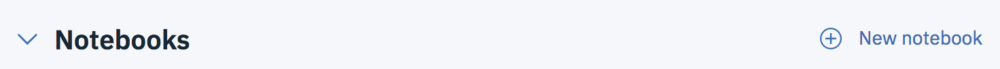

# Create a Model from Jupyter Notebook using PySpark

In this lab you will put yourself in the shoes of a Data Scientist that will build a predictive model, still for **churn prediction** but writing code in a **Jupyter Notebook**.

## Create a Notebook from a file
1. From your **IBM Watson Studio** project, create a new `Notebook`

2. 
