# Analyse Job Offers with Watson Natural Language Classifier

Develop a simple Watson Natural Language Classifier to categorize Job Descriptions.

In this lab you'll use **Watson Natural Language Classifier** to categorize Job Description data so we can gather insights on the effectiveness of the Job Classification model based on Function and Job Title.

## What is Natural Language Processing and where can it be used?
NLP provides a computer program the ability to understand real human language. It can also be used to understand the context in which the speaker is talking in.

This can be useful when building a chatbot for customer service. The customer has to type in the problem and the chatbot will use NLP to understand the problem and give out an appropriate response. This can help shorten queue lines, wait times in Tech Support call centers.

Another example could be to quickly filter through millions of restaurant reviews and classify them based on the things that the customers liked/disliked. This might provide insights into what the restaurant might be lacking and what things need to be improved.

## Introduction
Imagine we want to use NYC Open Data's Job Category data set, an open-source data set that contains the various job titles and descriptions of jobs the City of New York has posted on its hiring website. The data is available from the City of New York and you are free to share, remix, or make commercial use of the content in whatever way you like.

> **Problem:**
> + Going through each Job Definition manually is impractical since there are a lot of Job Offers.
> + Job Seekers have millions of ways of describing their experience and the type of jobs they are looking for. There is no way we can program in every word/sentence they might use.

But lucky for us we have **Watson NLP**. We will use **IBM Watson Natural Language Classifier** to filter and classify Job Descriptions into Job Categories: hiring agency, Business Title, Civil Service Title and Job Category.

**Examples of the categories:**

+ **Hiring Agency:** NYC HOUSING AUTHORITY, DEPT OF ENVIRONMENT PROTECTION, DEPT OF CITYWIDE ADMIN SVCS...
+ **Business Title:** Marine Section, Administration, Financial Services...
+ **Service Title:** Maintenance & Operations, Information Technology & Telecommunications...
+ **Job Category:** GRAPHIC ARTIST, PAINTER, COMPUTER PROGRAMMER ANALYST...

---
## Lab Instructions

### Setting up your environment
**Natural Language Classifier** tooling is part of **IBM Watson Studio**. In this section you will create a project and the Natural Classifier Service.

+ Connect to **IBM Watson Studio**: <http://dataplatform.ibm.com>
+ Login using your **IBMId** credentials
+ Create a new project of **standard** type and give it a relevant name
> Your project is a placeholder for data assets and models you will build. In order to work with **IBM Watson Natural Language Classifier** you need to attach an existing service to your project.  

+ Navigate to the *Settings* tab of your project.
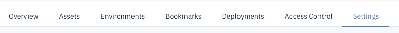
+ In the **Associated Services** section, select **Add service** and **Watson**
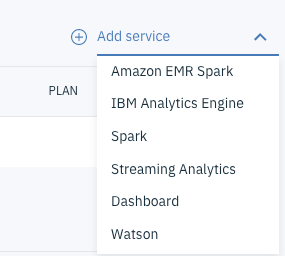
+ You'll be presented with a list of Watson Services, click **Add** on the Natural Language Classifier service.
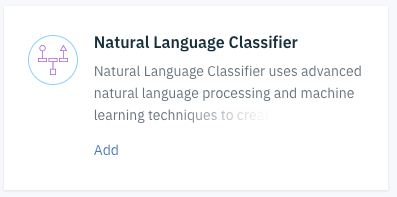
+ Unless you already have an existing **Watson Natural Language Classifier** service, create a new service selecting the standard plan and clicking **Create**.
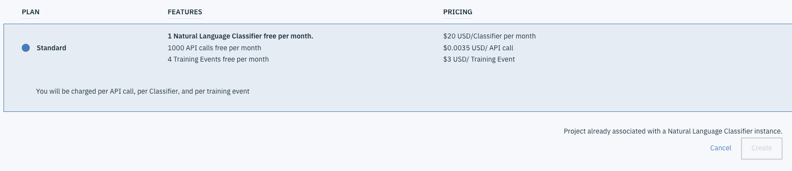
+ You should see the associated service shown in the project settings window.
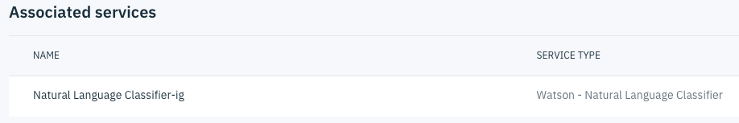

### Adding training data

We will train Natural Language Classifier to understand the different Job categories by providing some sample Job offering data. The model will then train on the job descriptions dataset and will be ready to begin categorizing job offerings that were never seen before.  

The training data is available from the [New York City Open Data Website](https://data.cityofnewyork.us/City-Government/NYC-Jobs/kpav-sd4t). For practical reasons the data has been prepared for you and is available [NYC_Jobs_Cleaned.csv](data/NYC_Jobs_Cleaned.csv)

> **Data Preparation:** You can provide the data to train the Natural Language Classifier in comma-separated value (CSV) format.
In the CSV format, a row in the file represents an example record. Each record has two or more columns. The first column is the representative text to classify. The additional columns are classes that apply to that text. The following image shows a CSV file that has four records. Each record in this sample includes the text input and one class, which are separated by a comma:
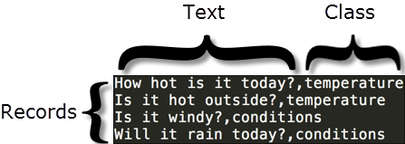
This example is a small sample. Proper training data includes many more records.
> **Size Limitations:** There are both minimum and maximum limits to the training data:
> + The training data must have at least five records (rows), no more than 20,000 records, and no more than 3,000 classes.
> + The maximum total length of a text value is 1024 characters.

+ In your project, click on the **Assets** tab and load the training data file *Jobs-Data1.csv* either by dragging and dropping it or by browsing to your desktop.
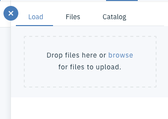
+ Upon upload completion, you should see the file shown in the **Data Assets**.
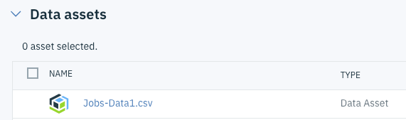
+ You can open the file to see a preview of the data.
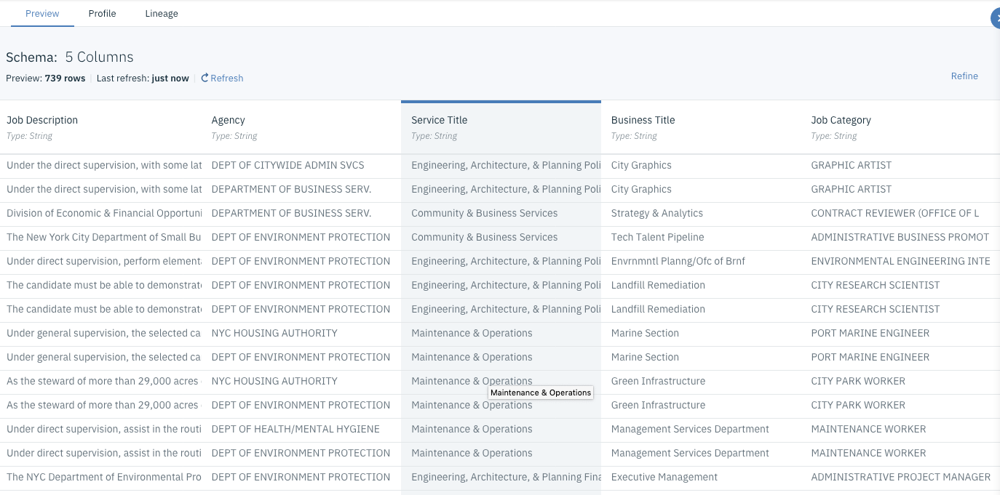
> **Note** the **Refine** button from the preview which will let you prepare your data using the embedded **Data Refinery** tool using built-in transformations and operations and/or writing R code operations. This is outside of the scope of this lab.  

At this stage we are ready to create our classifier.

### Create a classifier
+ From the project page, click **Add to Project** and select **Natural Language Classifier**.
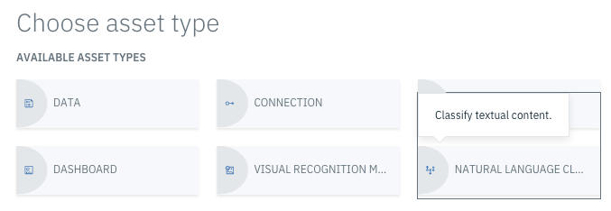
+ Give a meaningful name to your classifier, such as **Job Category**

+ You have the option to manually create a classifier by providing the data or uploading a CSV.
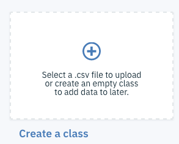
+ Hopefully, **IBM Watson Studio** lets you create a class directly from the project's data assets. Click on the elipsis next to the Data Asset and select **Add to Model**.
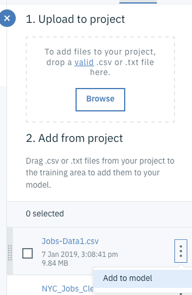
+ Some classes might be incomplete or might contain errors. You can use the tooling to change the classes that contain errors.
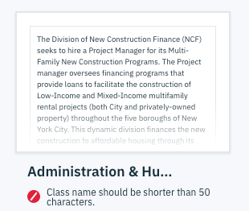
+ Errors might be in the text itself, opening a class will allow you to change or add text using the text editing capabilities of **Watson Studio**.
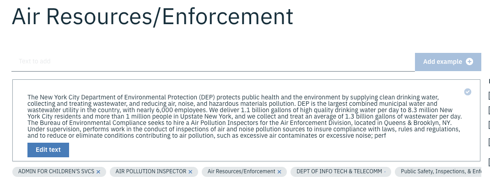
+ Once all errors are corrected, the model or classifier will be in a ready to train status. Click on **Train Model** and specify the correct language, in our case English.
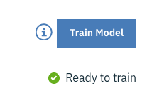

> This is where all the Watson magic happens. Watson Natural Language Classifier will try to learn the relationship between the review data we provided with the labels. Ideally we want to enter a minimum of 1000 different job descriptions for each category to get accurate results.

The training takes some time and the notification bar will inform you once it is completed.

### Test and Improve the classifier
+ Navigate to the project page, and click on the created Classifier. This will open the **Overview** page of the Job Category classifier. If training is still in process, you'll see it in its status.
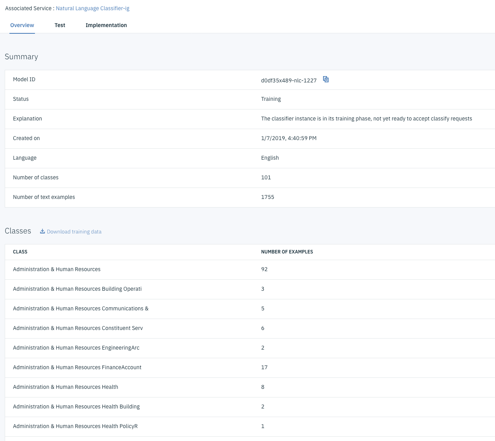
+ Once training is completed, you can test your Classifier from the **Test** tab.
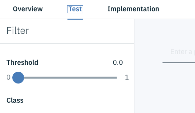
+ You can use some of the provided examples of Job Descriptions in the *Enter a phrase to classify* and click **Classify**. Results show corresponding classes along a confidence score.
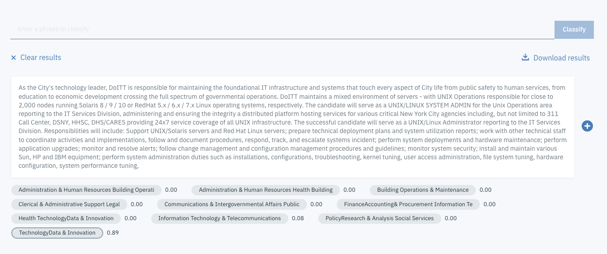
> Note that the plus sign next to the text you classified can be used to feeback the model and enrich the training set adding the phrase to the model.

### Integrate your model within Applications
A trained model is meant to be invoked from business applications. **IBM Watson Natural Classifier** provides an API endpoint which you can use.
+ Click on the **Implementation** tab of your model, the left sidebar shows a list of programming language, each containing the appropriate code snippets to classify a phrase or multiple phrases.
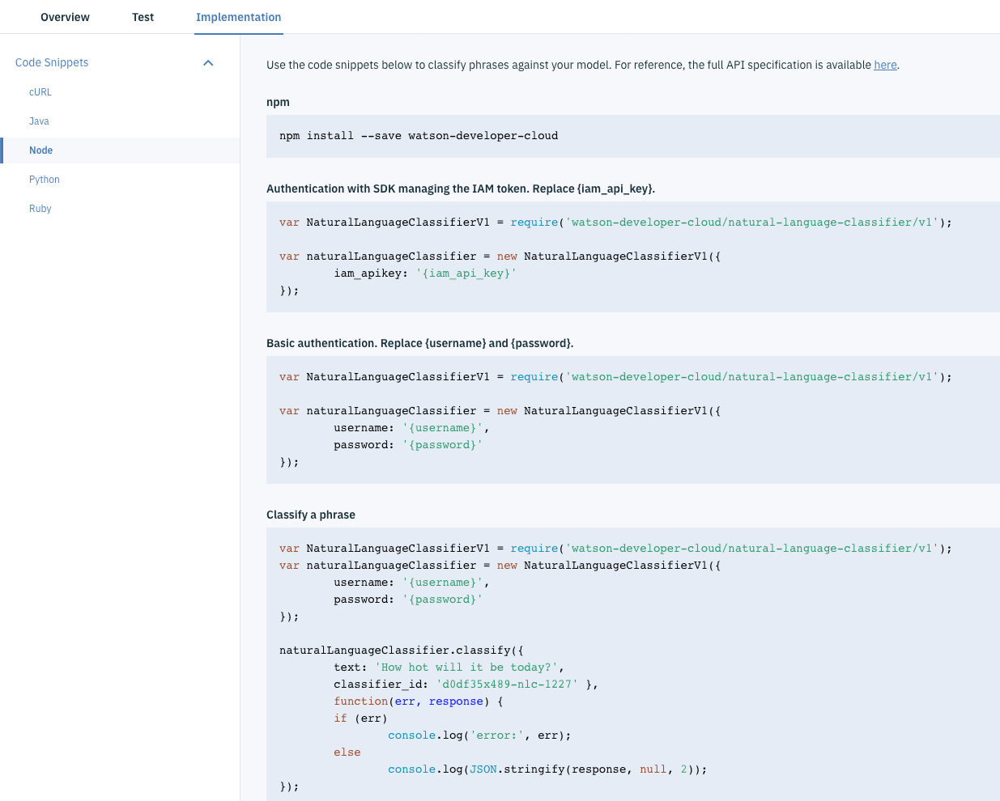
+ In addition to the code snippet, and if you are familiar using NodeRed, there is a **node** which provides an  easy wrapper node to use the NLC API.
  
The node has 4 modes:
    + **Classify:** matches the input with the classifier and returns the top classes with a confidence rating.
    + **Train:** creates a classifier from the input training data. The training data should be a String or String Array.
    + **Remove:** deletes a classifier
    + **List:** produces an array of available classifiers

> If you plan to use NodeRed for the assignment, this [article](https://github.com/watson-developer-cloud/node-red-labs/blob/master/basic_examples/natural_language_classifier/README.md) will provide you example flows to use a basic weather classifier.

---
