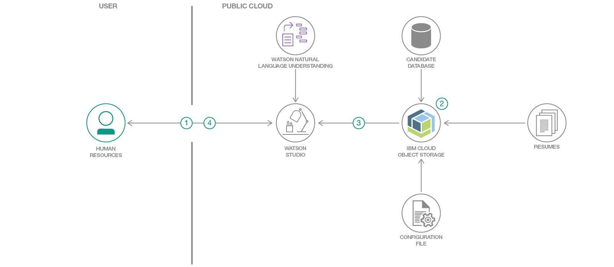
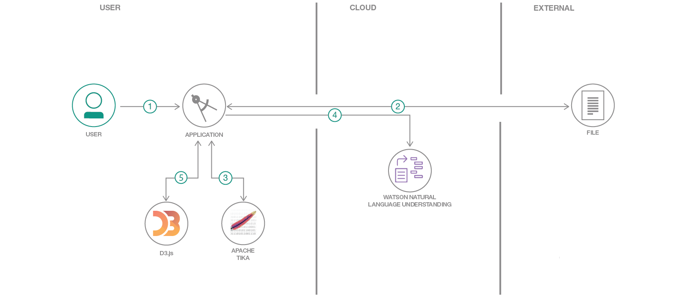
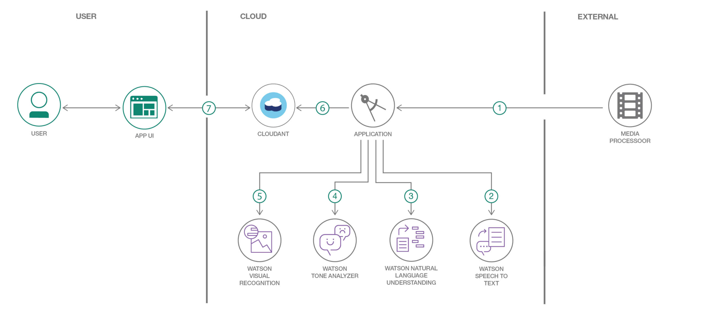
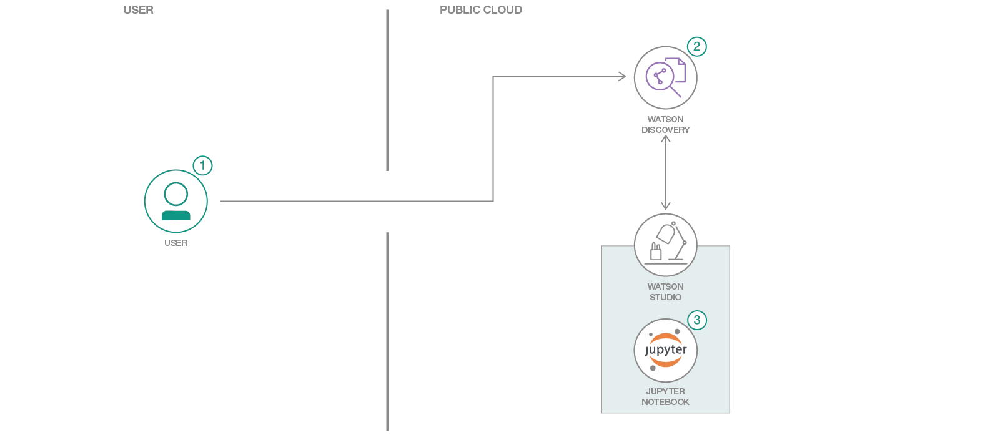
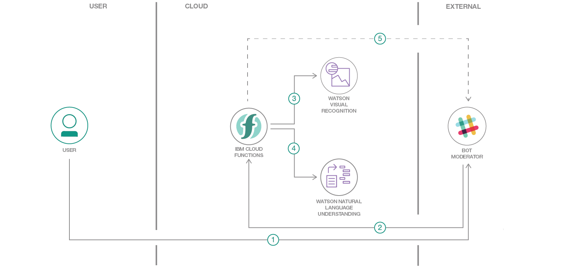

# Labs section for the Natural Language Processing workshop

The workshop covers a series of NLP technologies:
+ Watson Natural Language Classifier
+ Watson Natural Language Understanding
+ Watson Discovery
+ Watson Knowledge Studio

---
**Mandatory Labs are:**
+ The Watson Natural Language Classifier lab: [here](Lab1-Natural_Language_Classifier.md)
+ The Watson Discovery and Knowledge Studio lab: [../watson-discovery-food-reviews/README.md](https://github.com/Azzoz06/watson-food-review)  

---

## Watson Natural Language Classifier

+ Lab for Watson Natural Language Classifier can be found [here](Lab1-Natural_Language_Classifier.md)
  This Lab will walk you through the creation of a Classifier to categorize **Job Offers** from the New York City Open Data.  

+ Get Started with AI in 15 Minutes Using Text Classification on **AirBnb** reviews  
https://medium.com/ibm-watson/get-started-with-ai-in-15-minutes-28039853e6f3

## Watson Natural Language Understanding
+ This **Code Pattern** demonstrates a methodology to integrate structured data & unstructured data to generate recommendations for Human Resources to better spot talents.  
 https://github.com/IBM/generate-insights-from-data-formats-with-watson/blob/master/README.md
 

+ In this code pattern, we will create a web app for visualizing unstructured data using **Watson Natural Understanding**, Apache Tika, and D3.js.
https://github.com/IBM/visualize-unstructured-data-with-watson/blob/master/README.md

+ In this **Code Pattern** you will use several Watson services to showcase how media (both audio and video) can be enriched on a timeline basis.
https://github.com/IBM/watson-multimedia-analyzer/blob/master/README.md

+ Check out all other resources from the **IBM Watson Natural Understanding** documentation at https://console.bluemix.net/docs/services/natural-language-understanding/additional-resources.html#additional-resources

## Watson Discovery and Knowledge studio
+ This **Code Pattern** will walk you though the process of creating and application to discover customer sentiment from product reviews.
[../watson-discovery-food-reviews/README.md](../watson-discovery-food-reviews/README.md)  

+ Use Watson Discovery News to analyze cryptocurrency sentiment
https://github.com/IBM/crypto-discovery-news-sentiment-analysis/blob/master/README.md

## Leverage Watson Natural Language Understanding and Visual Recognition
+ Create a cognitive moderator chatbot for anger detection, natural language understanding and explicit images removal
https://github.com/IBM/cognitive-moderator-service/blob/master/README.md

## Watson Assistant
+ How to build a Chatbot: https://cognitiveclass.ai/courses/how-to-build-a-chatbot/
