# WatsonML-Jupyter-CNN4HandwrittenNum

## Handwritten digit recognition with MNIST using IBM Watson Studio Jupyter Notebook in Python & Watson Machine Learning capabilities & Toolbox (ART) - for Data Scientist.


This tutorial shows IBM Watson Studio framework capabilities to create Jupyter notebook leveraging Keras ML framework to create a convolutional neural network (CNN) model that is build & trained & improved in term of robustness & accuracy with IBM Watson Machine Learning Toolbox ART & IBM Watson ML capabilities.

## Introduction
Watson Studio provides you with the environment and tools to solve your business problems by collaboratively working with data. You can choose the tools you need to analyze and visualize data, to cleanse and shape data, to ingest streaming data, or to create, train, and deploy machine learning models.

This illustration shows how the architecture of Watson Studio is centered around the project. A project is where you organize your resources and work with data.


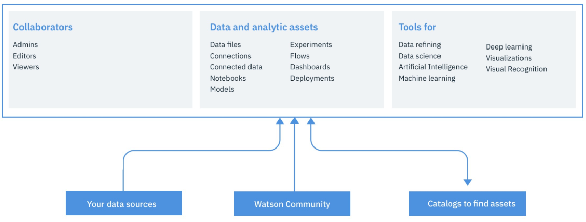


This tutorial will leverage IBM ART(Adversarial Robustness Toolbox) open source library
availalbe [here](https://github.com/IBM/adversarial-robustness-toolbox)

This is a library dedicated to adversarial machine learning. Its purpose is to allow rapid crafting and analysis of attacks and defense methods for machine learning models. The Adversarial Robustness Toolbox provides an implementation for many state-of-the-art methods for attacking and defending classifiers.

The ART toolbox is developed with the goal of helping developers better understand:

	Measuring model robustness
	Model hardening
	Runtime detection


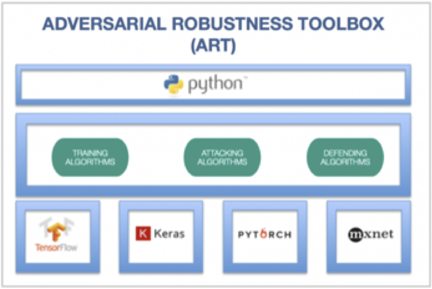


For more information you can read "Adversarial Robustness Toolbox v0.3.0" IBM research publication from Nicolae, Maria-Irina and Sinn, Mathieu and Tran, Minh~Ngoc and Rawat, Ambrish and Wistuba, Martin and Zantedeschi, Valentina and Baracaldo, Nathalie and Chen, Bryant and Ludwig, Heiko and Molloy, Ian and Edwards, Ben
available [here](https://arxiv.org/pdf/1807.01069)


##  Step 1 - Create your notebook

Once logged in the Watson Studio platform within a project create a new Notebook Select a name for your notebook and python language
For the runtime select the biggest one you can depending on the price (free or not)


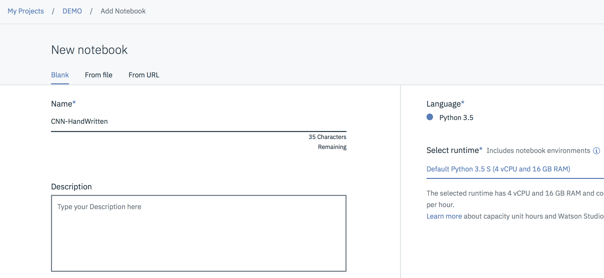

You're now ready to start writing your Handwritten digit Keras CNN and test it.


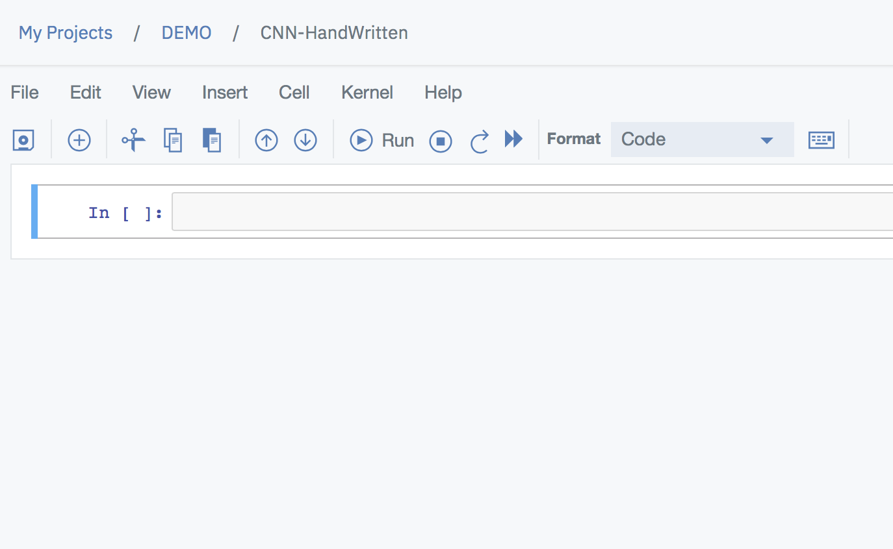

Start "copy/paste" the following code into the first cell then click the run button to view the output of the excecution of your code
the goal of this snippet is to install the ART libs into our environment
and import all required classes.
Keras version will be 2.2.4 i nthis tutorial.

```
!pip install adversarial-robustness-toolbox

from keras.models import load_model
from art.utils import load_dataset
from art.classifiers import KerasClassifier
from art.attacks.fast_gradient import FastGradientMethod
from art.attacks.newtonfool import NewtonFool
from art.attacks.iterative_method import BasicIterativeMethod
from art.defences.adversarial_trainer import AdversarialTrainer

%matplotlib inline

import numpy as np
import matplotlib.pyplot as plt
import keras.backend as k
from keras.models import Sequential
from keras.layers import Dense, Flatten, Conv2D, MaxPool2D, Dropout
from keras.optimizers import RMSprop
import numpy as np
from matplotlib import pyplot as plt

import warnings
warnings.resetwarnings()  # Maybe somebody else is messing with the warnings system?
warnings.filterwarnings('ignore')  # Ignore everything
import keras
print("Keras version  :",keras.__version__)
```

You should get something like :


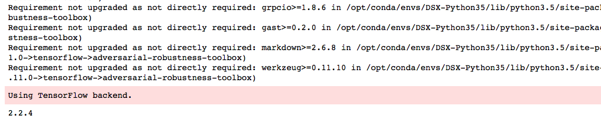


Now copy/paste the following utility functions to manipulate images
and run it


```
def Show_Images(imgTable, Size):
    Index = 0
    while Index < Size :
        # Plotting adversarial samples of MNIST
        plt.imshow(imgTable[Index].squeeze())
        plt.show()
        Index = Index + 1
    return

def CheckImagesAcc(imgTable, LabelTable, predicted, NbViews):
    IND = 0
    NbErrors = 0
    Views = 0
    while IND < len(imgTable):
        predt = np.argmax(predicted[IND])
        real = np.argmax(LabelTable[IND])    
        if (predt != real):
            if (Views < NbViews):
                print("MODEL mismatch ---> predicted : ",predt," to real :",real,"for Indice : ",IND)
                # Plotting first samples of MNIST
                image = plt.imshow(imgTable[IND].squeeze())
                plt.show()
                Views = Views + 1
            NbErrors = NbErrors + 1
        IND = IND + 1  
    return NbErrors
```


##  Step 2 Prepare & Cleanse dataset

Load pre-shuffled MNIST data into train and test datasets
and create our CNN model to be trained.

again copy/paste the code below & run it

```
# Read MNIST dataset
(x_train, y_train), (x_test, y_test), min_, max_ = load_dataset(str('mnist'))

# Create Keras convolutional neural network - basic architecture from Keras examples

k.set_learning_phase(1)
model = Sequential()
model.add(Conv2D(32, kernel_size=(3,3), activation='relu', input_shape=x_train.shape[1:]))
model.add(MaxPool2D(pool_size=(2,2)))
model.add(Flatten())
model.add(Dense(128, activation='relu'))
model.add(Dropout(0.25))
model.add(Dense(10, activation='softmax'))

model.compile(loss='categorical_crossentropy', optimizer='adam', metrics=['accuracy'])

# Set Hyperparameters
Optimizer = RMSprop(lr=0.001, rho=0.9, epsilon=1e-08, decay=0.0)
# Initialize and compile:
model.compile(optimizer=Optimizer, loss='categorical_crossentropy', metrics=['accuracy'])
model.summary()
```

You should see therefore a summary of our ANN model as shown hereafter
Note the total number of weights & bias to be determine during the training sequence and understand how complex can be to train very complex ANN with hundreds of layers (here we have only 3 !).

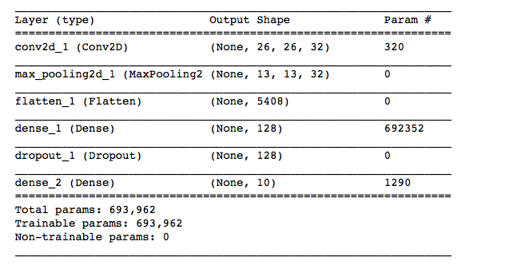


**Conv2D**
It is a 2D convolutional layer that we use to process the 2D MNIST input images. The first argument passed to the Conv2D() layer function is the number of output channels – in this case we have 32 output channels.
The next input is the kernel_size, which in this case we have chosen to be a 3×3 moving window, next, the activation function is a rectified linear unit and finally we have to supply the model with the size of the input to the layer (which is declared in another part of the code.
Declaring the input shape is only required of the first layer.
Keras is good enough to work out the size of the tensors flowing through the model from there.

**MaxPool2D** (Reduction matrix)

**Flatten** (Transform an input shape n*c*h*w into a n*(c*h*w) vector)

**Dense** (each neuron is linked to the ones of the n+1 layer)

**DropOut** (freeze some neurons to avoid overfitting)

**SoftMax** (Transform a scoring distribution in a Probability distribution)

**lr** (Learning rate, interval used for the gradient descent algorithm)

**loss** (Cost/loss function used for this neural network, e.g. linear regression)

**Activation** (function used to ponderate the output of the neurone)


then insert the following line of code and you will see one sample of an image from MNIST
increase the second parmaeter to see more digit images and run the cell.

```
Show_Images(x_train,2)
```

You shoud see the following model summary :


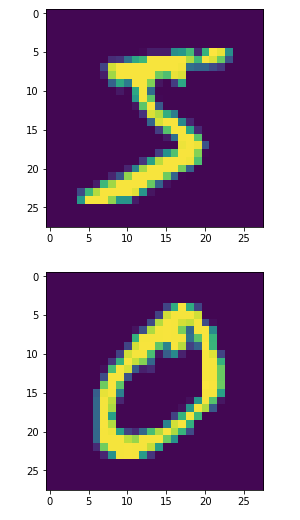


##  Step 3 Build,test & run the CNN model


Now we are ready to train our defined model against the MNIST training data.
copy/paste & excute the code below :

```
# Train the Classifier wrapper
Original_Classifier = KerasClassifier((0,1),model,use_logits=False)
Original_Classifier.fit(x_train, y_train, batch_size=128, nb_epochs=10)
scores = model.evaluate(x_test, y_test, verbose=1)
print("Baseline Error: %.2f%%" % (100-scores[1]*100))
```

You should see the various iterations, epochs with an accuracy & loss values associated to the model :

<center>
**You should see different numbers on your notebook for the success ratio....
Fully explainable as the training & test dataset are selected randomly from MNIST
So nobody should have exaclty the same dataset from a statistical point of view but
differences must be very minor.**
</center>

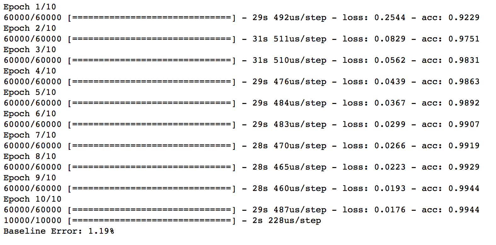


##  Step 4 Analyse results

Finally let's see what are the digits not recognized by our generated model.

```
# Test the classifier against fresh test data
predictions = Original_Classifier.predict(x_test[:len(x_test)])

NbErrors = CheckImagesAcc(x_test, y_test, predictions, 5)
OriginalAccOnTest = (100-(NbErrors/len(x_test))*100)
print("Original Classifier Succcess ratio on Test Images : %.2f%%" % OriginalAccOnTest)
```


You should see depending on the implemented model :
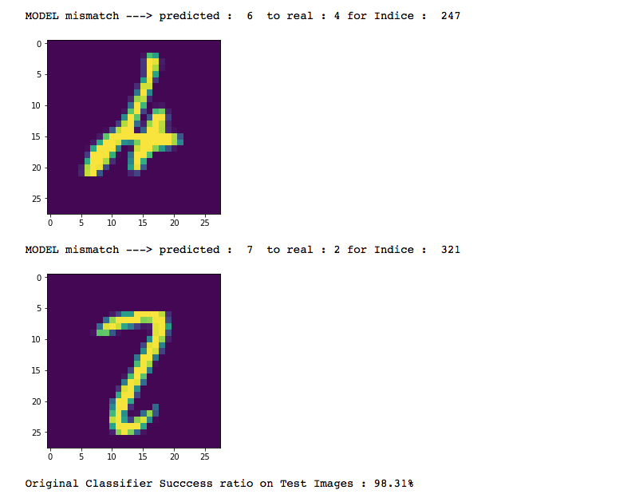

Now let's start challenging our Hand Digit recognition model.
Thanks to the ART toolbox we have a full set of attacks & defense available to assess our classifier.


##  Step 5 Assess the quality of our Classifier

The ART library contains implementations of the following evasion attacks:

	DeepFool (Moosavi-Dezfooli et al., 2015)
	Fast Gradient Method (Goodfellow et al., 2014)
	Basic Iterative Method (Kurakin et al., 2016)
	Projected Gradient Descent (Madry et al., 2017)
	Jacobian Saliency Map (Papernot et al., 2016)
	Universal Perturbation (Moosavi-Dezfooli et al., 2016)
	Virtual Adversarial Method (Miyato et al., 2015)
	C&W Attack (Carlini and Wagner, 2016)
	NewtonFool (Jang et al., 2017)

Let use one of them for this tutorial the Fast Gradient Method and assess our model against it.
MNIST training dataset is made of 60000 samples so to save some time let's create only 10% of modified data from it.

Copy/paste the following code :

```
# Create modified train sub dataset (100 first images) with noise on it.
# Craft adversarial samples with the FastGradient Method
adv_crafter_FGM = FastGradientMethod(Original_Classifier, eps=0.5)
x_train_adv_FGM = adv_crafter_FGM.generate(x_train[:(len(x_train)//10)])
x_test_adv_FGM = adv_crafter_FGM.generate(x_test[:len(x_test)])
Show_Images(x_train_adv_FGM,3)
```

you should see what are the modified images using this method (introdfucing some noise on it)


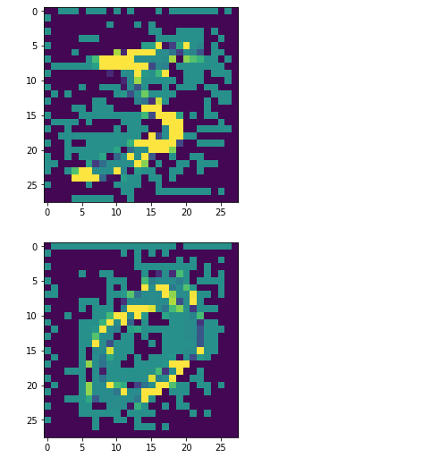


Now assess our classifier against this new training dataset :
Copy /paste the following code and run it :

```
# Challenge the Classifier with FastGradient modified dataset
predictions = Original_Classifier.predict(x_test_adv_FGM[:len(x_test_adv_FGM)])

NbErrors = CheckImagesAcc(x_test_adv_FGM, y_test, predictions, 10)
print("Original Classifier Succcess ratio on Adversarial FastGradient Images: %.2f%%" % (100 - (NbErrors/len(x_test_adv_FGM))*100))
```

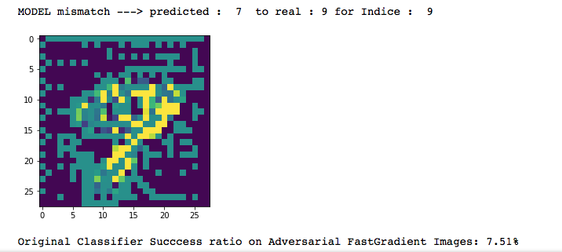

the quality of our model goes down from 98,31% accuracy to 7.51% !!!!
and this is just a simple example so you cannot think about deplyoing this classifier in a real world production system with so much hole in term of accuracy !!

Again thanks to our ART toolbox to provide a set of librairies to increase during the training the accuracy and various known attacks.

Please refer to the gitHub article from ART to get a full sample on how to train more efficiently your classifier.

In this tutorila let's explore some interesting we can observe rapidly that proof the ART's added value.

To do so let's enrich our intiial training data with the one we just created for the Fast Method Gradient Attack.

Copy/paste the code below :

```
# Data augmentation: expand the training set with the adversarial samples
x_train_robust = np.append(x_train, x_train_adv_FGM, axis=0)
y_train_robust = np.append(y_train, y_train[:len(x_train_adv_FGM)], axis=0)

x_test_robust = np.append(x_test, x_test_adv_FGM[:len(x_test_adv_FGM)], axis=0)
y_test_robust = np.append(y_test, y_test[:len(x_test_adv_FGM)], axis=0)

# Retrain the CNN on the extended dataset
model.compile(loss='categorical_crossentropy', optimizer='adam', metrics=['accuracy'])

Robust_Classifier = KerasClassifier((0,1),model,use_logits=False)
Robust_Classifier.fit(x_train_robust, y_train_robust, nb_epochs=10, batch_size=128)
```

Again we now have a robust trained classifier as shown below :

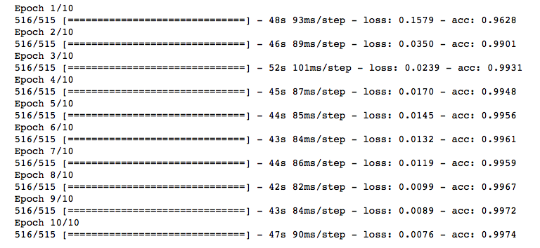

Let's make sure we've made some significant improvement with our Fast Gradient attack method ....copy/paste the code below :

```
# Challenge the Robust Classifier with FastGradient modified dataset
predictions = Robust_Classifier.predict(x_test_adv_FGM[:len(x_test_adv_FGM)])
NbErrors = CheckImagesAcc(x_test_adv_FGM, y_test, predictions, 10)
RobustAccOnTest = (100 - (NbErrors/len(x_test_adv_FGM)*100))
print("Robust Classifier Succcess ratio on Adversarial FastGradient Images: %.2f%%" % RobustAccOnTest)
```
and obviously we've made significant progress from 7.51% accuracy to 96.19% ....

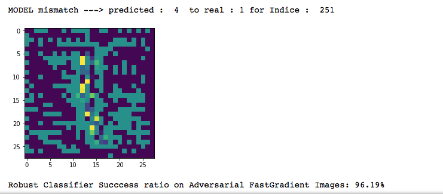

And Finally what about the original test images without attack artificats on its, did we also improved our model regarding "regular" test images ??????

```
predictions = Robust_Classifier.predict(x_test[:len(x_test)])
NbErrors = CheckImagesAcc(x_test, y_test, predictions, 0)
RobustAccOnTest = (100-(NbErrors/len(x_test))*100)
print("Robust Classifier : %.2f%% vs Original Classifier : %.2f%%" % (RobustAccOnTest,OriginalAccOnTest))
```


<center><p>
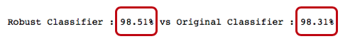
</p></center>


As dreamt ... YES we did some increment in our tutorial but imagine mixing all these attacks together and the gain you can make on your model robustness & accuracy.
Definitively ART must be part of your Deep Learning journey to make your DL model business ready !

##  Step 5 : Conclusion

Last percent is the real challenge in Deep Learning and can make the difference between a good model and a deployed model.
Remember 100% accuracy is a myth, you will never reach it but make sure to be the nearest.


By looking at the overall digits for which our model was not working it appears clearly that our model is missing some handwritten common sense.
Because as human we've learned to draw digit with a pen on a paper we have on top of what we see the knwoledge of the digit drawing pattern that allows us to be 50% better than the generated model.
That's true for all deep learning technics to be accurate enough there is a need for more than just perception capabilities.
In a nutshell reasoning and more importantly common sense are required to be called **Artificial Intelligence**

Think of Autonomous Cars, Surgery robotics !!!

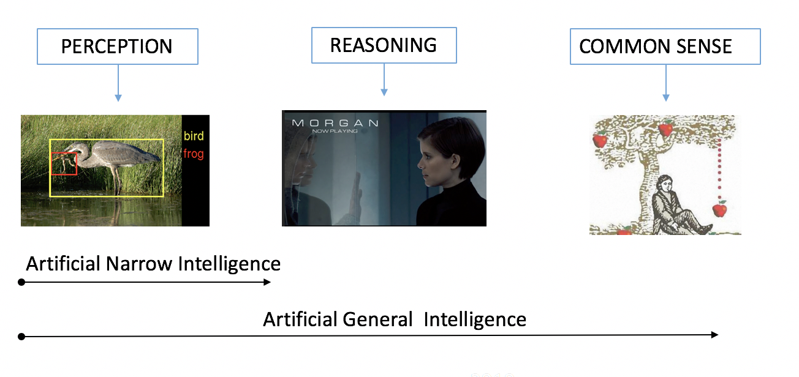

How to build that, DL gurus are working on that, with technics similar to what we saw here called adversarial network where One ANN is in charge to challenge another reponsible for the modeling (in our case one ANN using autoencoder neurons willgenerate 1000 times more training data for each digit taking into account how to draw a digit and therefore the 2nd ANN will learn that from the training dataset.
Such technics are prooven step forwards in DL for business.

Please feel free to share this tutorial and provide me with your remarks, questions, I would appreciate


[LinkedIn](http://fr.linkedin.com/pub/jean-luc-collet/9/541/740)

Thanks !

Jean-Luc Collet
July 11, 2018
