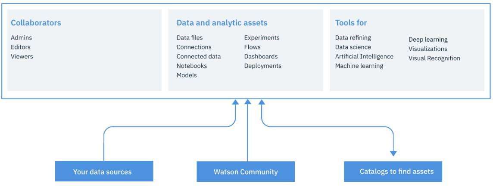
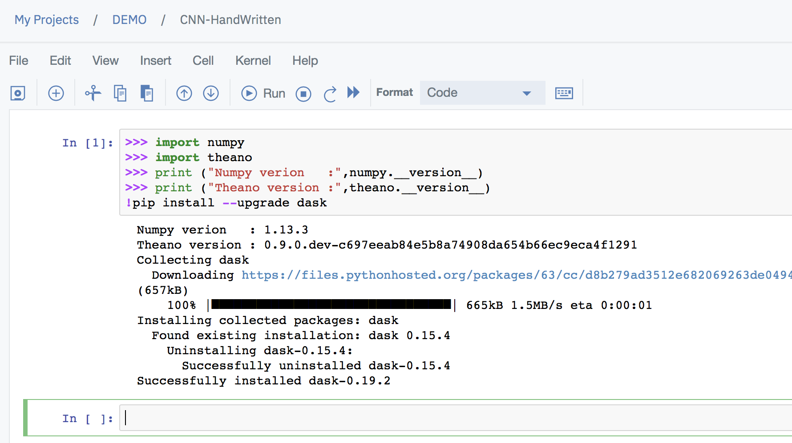
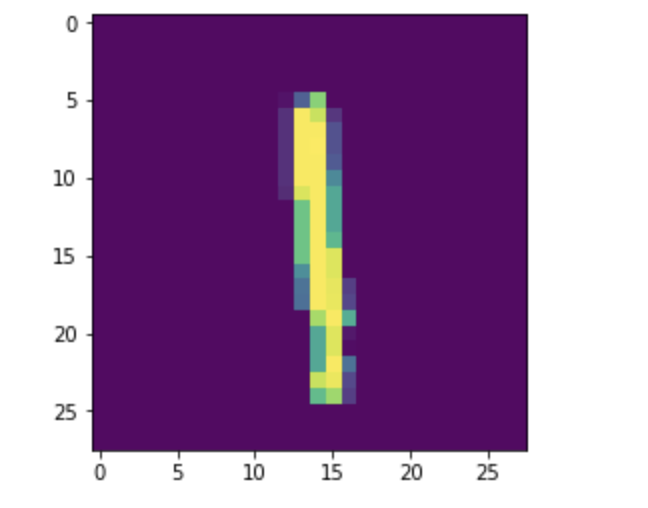
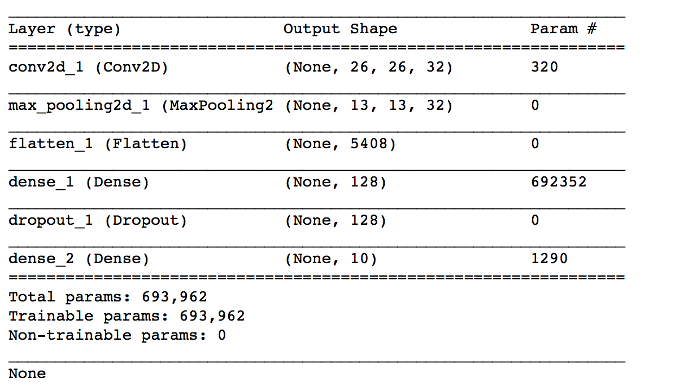
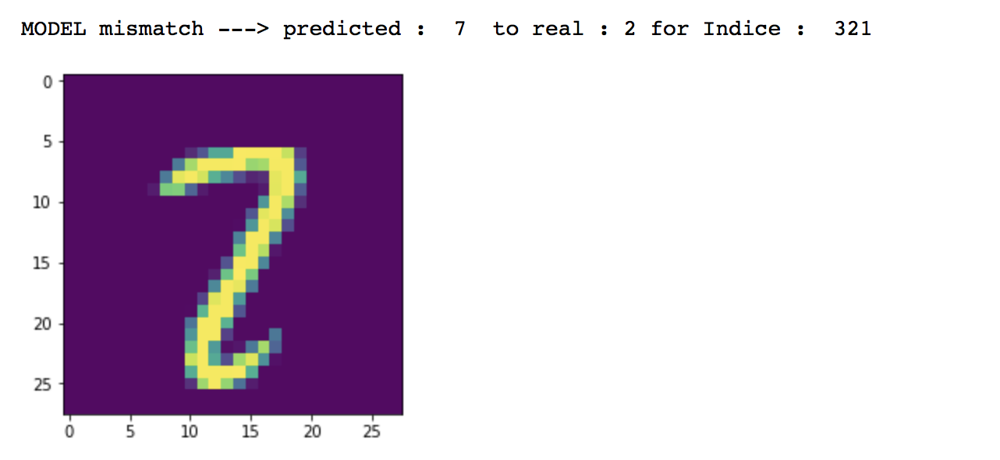

# WatsonML-Jupyter-CNN4HandwrittenNum

## Handwritten digit recognition with MNIST using IBM Watson Studio Jupyter Notebook in Python & Watson Machine Learning capabilities - Part 2 : for Data Scientist.

This tutorial shows IBM Watson Studio framework capabilities to create Jupyter notebook leveraging Keras ML framework to create a convolutional neural network (CNN) model that is build & trained with IBM Watson Machine Learning part of IBM Watson ML capabilities.

## Introduction
Watson Studio provides you with the environment and tools to solve your business problems by collaboratively working with data. You can choose the tools you need to analyze and visualize data, to cleanse and shape data, to ingest streaming data, or to create, train, and deploy machine learning models.

This illustration shows how the architecture of Watson Studio is centered around the project. A project is where you organize your resources and work with data.


##  Step 1 - Create your notebook
Once logged in the Wastson Studio platform within a project create a new Notebook Select a name for your notebook and python language
For the runtime select the biggest one you can depending on the price (free or not)


You're now ready to start writing your Handwritten digit Keras CNN and test it.


Start typing the following code into the first cell then click the run button to view the output of the excecution of your code:
``` python
>>> import numpy
>>> import theano
>>> print ("Numpy verion   :",numpy.__version__)
>>> print ("Theano version :",theano.__version__)
!pip install --upgrade dask
```
You should get something like :


Dask Library uses existing Python APIs and data structures to make it easy to switch between Numpy, Pandas, Scikit-learn to their Dask-powered equivalents.

Now import required libraries as follow
``` python
import numpy as np
from keras.models import Sequential
from keras.layers import Dense, Dropout, Activation, Flatten
from keras.layers import Conv2D, MaxPool2D
from keras.optimizers import RMSprop
from keras.utils import np_utils
from keras import backend as kr

from keras.datasets import mnist

np.random.seed(99)  # for reproducibility
```
**`random.seed(99)`** allows to start from the same entry point (required for reproducibility.
MNIST libraries are already in the notebook and doesn't need to be installed, still dataset will be downloaded.

##  Step 2 Prepare & Cleanse dataset
Load pre-shuffled MNIST data into train and test sets:
``` python
(X_train, y_train), (X_test, y_test) = mnist.load_data()
print (X_train.shape)
```
You shoud see : `(60000, 28, 28)` meaning 60K images of 28x28 pixels.

 * Plotting first samples of MNIST
From previous learning try to plot at least one image from MNIST Dataset

<details><summary>Click for a valid answer</summary>
<p>
``` python
from matplotlib import pyplot as plt
img = plt.imshow(X_train[0])
plt.show()
```
You should see the following sample image :

</p>
</details>

Now we need to reshape input data as MNIST images only have a depth of 1, but we must explicitly declare that.
So I transformed the dataset from having shape (n, width, height) to (n, depth, width, height).
See code below :
``` python
if kr.image_data_format() == 'channels_first':
    X_train = X_train.reshape(X_train.shape[0], 1, 28, 28)
    X_test = X_test.reshape(X_test.shape[0], 1, 28, 28)
    input_shape = (1, 28, 28)
else:
    X_train = X_train.reshape(X_train.shape[0], 28, 28, 1)
    X_test = X_test.reshape(X_test.shape[0], 28, 28, 1)
    input_shape = (28, 28, 1)
print (X_train.shape)
```
You should get :
`(60000, 28, 28, 1)`

Now let's convert 1-dimensional class (label are the direct value of the digit) while we want to have a arrays to 10-dimensional class matrices.
``` python
Y_train = np_utils.to_categorical(y_train,10)
Y_test = np_utils.to_categorical(y_test,10)
print (Y_train[0])
```
As output you should get :
**`[ 0.  0.  0.  0.  0.  1.  0.  0.  0.  0.]`** for a 5 in this example.

##  Step 3 Build,test & run the CNN model
Now let's create the CNN model
in Keras models can come in two forms Sequential and via the Functional API.
The Sequential model is widely used. It allows you to easily stack sequential layers (and even recurrent layers) of the network in order from input to output. The functional API allows you to build more complicated architectures (not the goal here)
``` python
model = Sequential()
```

Single convulational model wih 1 layer 

<details><summary>Click for a 1 layer CNN (Baseline Error: 1.19% & 30s per epoch)</summary>
<p>
``` python
model.add(Conv2D(32, kernel_size=(3,3), activation='relu', input_shape=input_shape))
model.add(MaxPool2D(pool_size=(2,2)))
model.add(Flatten())
model.add(Dense(128, activation='relu'))
model.add(Dropout(0.25))
model.add(Dense(10, activation='softmax'))
```
</p>
</details>

<details><summary>Click for a 3 layers CNN (Baseline Error: 0.74% & 150s per epoch)</summary>
<p>
``` python
model.add(Conv2D(32, kernel_size=(3,3),activation='relu',input_shape=input_shape))
model.add(Conv2D(32, kernel_size=(3,3), activation='relu'))
model.add(MaxPool2D((2,2)))
model.add(Conv2D(32, kernel_size=(3,3), activation='relu'))
model.add(Flatten())
model.add(Dense(units=128, activation='relu'))
model.add(Dropout(0.1))
model.add(Dense(units=10))
model.add(Activation('softmax'))
```

</p>
</details>

**Conv2D**
It is a 2D convolutional layer that we use to process the 2D MNIST input images. The first argument passed to the Conv2D() layer function is the number of output channels – in this case we have 32 output channels. 
The next input is the kernel_size, which in this case we have chosen to be a 3×3 moving window, next, the activation function is a rectified linear unit and finally we have to supply the model with the size of the input to the layer (which is declared in another part of the code.
Declaring the input shape is only required of the first layer. 
Keras is good enough to work out the size of the tensors flowing through the model from there.

 * **MaxPool2D** (Reduction matrix)
 * **Flatten** (Transform an input shape nxcxhxw into a nx(cxhxw) vector)
 * **Dense** (each neuron is linked to the ones of the n+1 layer)
 * **DropOut** (freeze some neurons to avoid overfitting)
 * **SoftMax** (Transform a scoring distribution in a Probability distribution)

Initialize and compile the model
``` python
Optimizer = RMSprop(lr=0.001, rho=0.9, epsilon=1e-08, decay=0.0)
model.compile(optimizer=Optimizer,loss='categorical_crossentropy',metrics=['accuracy'])
print(model.summary())
```

You should see depending on the implemented model :


Now we can train, test and evaluate the generated model
``` python
model.fit(X_train, Y_train, batch_size=128, epochs=10, verbose=1)
scores = model.evaluate(X_test, Y_test, verbose=1)
print("Baseline Error: %.2f%%" % (100-scores[1]*100))
```

You should see depending on the implemented model :


##  Step 4 Analyse results
Finally let's see what are the digit not recognized by our generated model.

``` python
from matplotlib import pyplot as plot

prev = model.predict(X_test[:len(X_test)])

# restore initial structure for image rendering 
X_test = X_test.reshape(X_test.shape[0], 28, 28)

IND = 0
NbErrors = 0
while IND < len(X_test):
    predt = np.argmax(prev[IND])
    real = np.argmax(Y_test[IND])
    
    if (predt != real):
         print("MODEL mismatch ---> predicted : ",predt," to real :",real,"for Indice : ",IND)
         # Plotting first samples of MNIST
         image = plot.imshow(X_test[IND])
         plot.show()
         NbErrors = NbErrors + 1
    IND = IND + 1  

print("For ",IND,"samples ", NbErrors, " were not well predicted")
print("END")
```

You should see depending on the implemented model :


##  Step 5 : Conclusion
By looking at the overall digits for which our model was not working it appears clearly that our model is missing some handwritten common sense.
Because as human we've learned to draw digit with a pen on a paper we have on top of what we see the knwoledge of the digit drawing pattern that allows us to be 50% better than the generated model.
That's true for all deep learning technics to be accurate enough there is a need for more than just perception capabilities.
In a nutshell reasoning and more importantly common sense are required to be called **Artificial Intelligence**

Think of Autonomous Cars, Surgery robotics !!!


Please feel free to share this tutorial and provide me with your remarks, questions, I would appreciate

Thanks !

[Jean-Luc Collet](http://fr.linkedin.com/pub/jean-luc-collet/9/541/740) - 2018